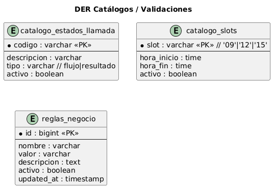
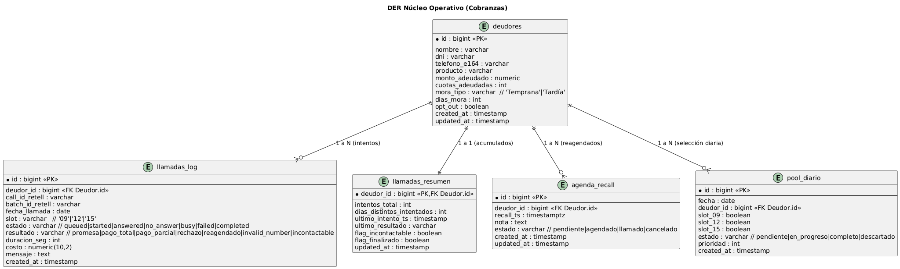
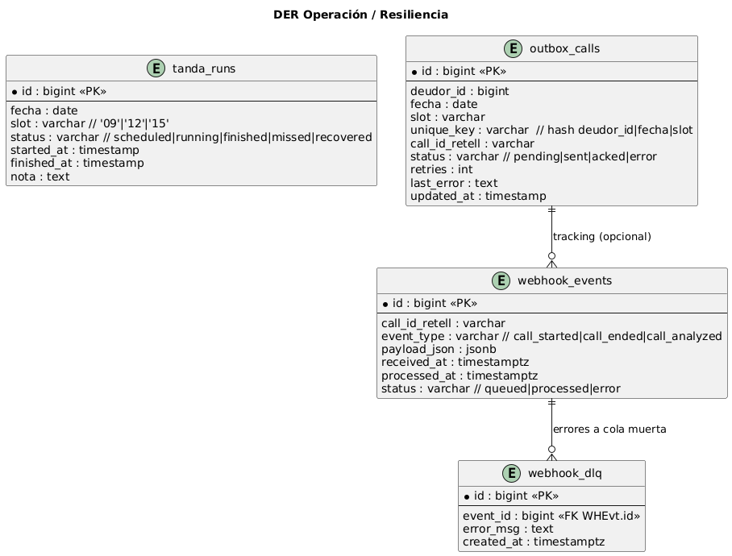

# 📞 Speech AI Call Tracking System

Sistema distribuido de procesamiento de llamadas automatizadas que replica workflows de n8n en Python, utilizando Retell AI para gestión completa del ciclo de vida de llamadas de cobranza.

## 🏗️ Arquitectura General

Este sistema está diseñado para:

1. **Procesar jobs de llamadas de cobranza** desde MongoDB
2. **Ejecutar llamadas automáticas** usando Retell AI
3. **Hacer seguimiento completo** hasta que cada llamada termine
4. **Guardar resultados detallados** para análisis y reportes

## 🚀 Características Principales

### ✅ Funcionalidades Core
- **Call ID Tracking** - Guarda call_id inmediatamente tras crear la llamada
- **Polling System** - Consulta estado de llamada hasta finalización
- **Result Storage** - Persiste transcripción completa, análisis y costos
- **Variable Mapping** - Envía todas las variables dinámicas al prompt de Retell
- **Cost Control** - Registra costos detallados por llamada
- **Retry Logic** - Reintentos inteligentes con delays por persona
- **Phone Management** - Maneja múltiples teléfonos por contacto
- **Concurrency** - Múltiples workers distribuidos
- **Error Handling** - Manejo robusto de fallos y recuperación

### ✅ Integraciones
- **MongoDB** - Base de datos principal para jobs y resultados
- **Retell AI** - API para llamadas de voz automatizadas
- **Python 3.12+** - Runtime principal
- **Docker Ready** - Containerización lista para producción

## � Requisitos del Sistema

### Dependencias
```
Python 3.12+
MongoDB 4.4+
Retell AI API Key
```

### Paquetes Python
```
pymongo>=4.8
python-dotenv>=1.0
requests>=2.32
tenacity>=9.0
```

## 🛠️ Instalación

### 1. Clonar el repositorio
```bash
git clone https://github.com/mariandamblena/speechAi.git
cd speechAi/app
```

### 2. Crear entorno virtual
```bash
python -m venv .venv
# Windows
.venv\Scripts\activate
# Linux/Mac
source .venv/bin/activate
```

### 3. Instalar dependencias
```bash
pip install -r requirements.txt
```

### 4. Configurar variables de entorno
```bash
cp .env.example .env
# Editar .env con tus valores
```

### Variables de Entorno Requeridas

```bash
# MongoDB Configuration
MONGO_URI=mongodb://localhost:27017
MONGO_DB=Debtors
MONGO_COLL_JOBS=call_jobs
MONGO_COLL_LOGS=call_logs

# Retell AI Configuration
RETELL_API_KEY=key_your_api_key_here
RETELL_BASE_URL=https://api.retellai.com
RETELL_AGENT_ID=agent_your_agent_id_here
RETELL_FROM_NUMBER=+1234567890

# Worker Configuration
WORKER_COUNT=3
LEASE_SECONDS=120
MAX_TRIES=3

# Call Tracking Configuration
CALL_POLLING_INTERVAL=15
CALL_MAX_DURATION_MINUTES=10
RETRY_DELAY_MINUTES=30
NO_ANSWER_RETRY_MINUTES=60
```

## 🚀 Uso

### Ejecutar el worker
```bash
python call_worker.py
```

### Reiniciar un job específico (para testing)
```bash
python reset_job.py <job_id>
```

### Ejemplo de output
```
=== INICIANDO CALL WORKER ===
MONGO_URI: mongodb://localhost:27017
MONGO_DB: Debtors
RETELL_API_KEY: ***7f60
WORKER_COUNT: 3
==============================

2025-09-22 13:34:57,943 | INFO | MainThread | Inicializando índices…
[DEBUG] [bot-1] ✅ Job encontrado: 68d1713d30b0c91f2f9b5a38
[DEBUG] [68d1713d30b0c91f2f9b5a38] ✅ Llamada creada exitosamente
[DEBUG] [68d1713d30b0c91f2f9b5a38] ✅ Estado final detectado: ended
```

## 🧩 Componentes del Sistema

### 1. JobStore - Gestión de Jobs 📝

**Responsabilidades:**
- Reclamar jobs de la cola con sistema de reservas (locking)
- Guardar call_id inmediatamente tras crear la llamada
- Almacenar resultados completos con análisis y costos
- Programar reintentos con delays inteligentes por persona
- Manejar estados del lifecycle completo

**Algoritmo de Reserva:**
```python
# Usa findOneAndUpdate para evitar race conditions
doc = self.coll.find_one_and_update(
    filter={"status": "pending"},
    update={
        "$set": {
            "status": "in_progress",
            "reserved_until": now + timedelta(hours=2),
            "worker_id": "bot-1"
        }
    }
)
```

### 2. RetellClient - API Integration 📞

**Funcionalidades:**
- Crear llamadas usando `/v2/create-phone-call`
- Consultar estado usando `/v2/get-call/{call_id}`
- Manejo de errores con retry automático
- Parsing robusto de respuestas API

**Variables Dinámicas Enviadas:**
```python
{
    "nombre": "RICHARD RENE RAMOS PEREZ",
    "empresa": "Natura", 
    "cuotas_adeudadas": "1",
    "monto_total": "104050",
    "fecha_limite": "2025-09-01",
    "fecha_maxima": "2025-09-05",
    "RUT": "27327203-8"
}
```

### 3. CallOrchestrator - Lógica de Negocio 🎭

**Procesos:**
- Selección de teléfonos (to_number → try_phones array)
- Mapeo de contexto desde job a variables Retell
- Ejecución de llamadas con manejo de errores
- Polling continuo hasta completar la llamada
- Clasificación de resultados (éxito vs. reintento)

## 🔄 Flujo de Procesamiento

### Etapa 1: Adquisición de Job
```
1. Worker busca jobs "pending" sin lease activo
2. Reserva job con findOneAndUpdate atómico
3. Incrementa counter de "attempts"
4. Asigna worker_id y timestamps
```

### Etapa 2: Preparación de Llamada
```
1. Selecciona próximo teléfono disponible
2. Mapea datos del job a variables Retell
3. Genera timestamp Chile actual
4. Valida configuración (API key, agent_id)
```

### Etapa 3: Ejecución de Llamada
```
1. POST /v2/create-phone-call a Retell
2. Guarda call_id inmediatamente en MongoDB
3. Inicia polling cada 15 segundos
4. Extiende lease periódicamente
```

### Etapa 4: Seguimiento (Polling)
```
1. GET /v2/get-call/{call_id} cada 15s
2. Evalúa status: ongoing → ended/error
3. Timeout máximo: 10 minutos
4. Logs detallados de cada consulta
```

### Etapa 5: Finalización
```
1. Extrae datos completos del resultado
2. Actualiza variables dinámicas capturadas
3. Calcula duración y costos
4. Programa reintento o marca como done
```

## 💾 Estructura de Datos MongoDB

### Estado Inicial del Job:
```json
{
  "_id": ObjectId("..."),
  "status": "pending",
  "rut": "273272038",
  "nombre": "RICHARD RENE RAMOS PEREZ",
  "to_number": "+5491136530246",
  "try_phones": ["+5491136530246"],
  "attempts": 0,
  "max_attempts": 3
}
```

### Durante Procesamiento:
```json
{
  "status": "in_progress",
  "worker_id": "bot-1",
  "call_id": "call_28ce0b42c2f20878076b6bc9cb0",
  "call_started_at": "2025-09-22T16:34:59.072Z",
  "reserved_until": "2025-09-22T18:34:58.080Z",
  "is_calling": true
}
```

### Resultado Final:
```json
{
  "status": "done",
  "call_duration_seconds": 97,
  "fecha_pago_cliente": "2025-09-01",
  "monto_pago_cliente": 104050,
  "call_result": {
    "success": true,
    "summary": {
      "call_cost": {"combined_cost": 1797},
      "call_analysis": {"call_successful": true, "user_sentiment": "Positive"},
      "recording_url": "https://...",
      "transcript": "Agent: Hola...",
      "disconnection_reason": "agent_hangup"
    }
  }
}
```

## 🔄 Sistema de Reintentos

### Lógica de Delays:
- **Llamadas exitosas:** `status = "done"`
- **No answer/busy:** 60 minutos de delay
- **Otros fallos:** 30 minutos de delay  
- **Sin teléfonos:** `status = "failed"` (terminal)

### Control de Teléfonos:
```python
1. Intenta to_number principal
2. Si falla, usa try_phones[0], try_phones[1], etc.
3. Marca last_phone_tried para seguimiento
4. Cuando se agotan, marca como failed
```

## 📊 Datos Capturados

El sistema captura y almacena los siguientes datos de cada llamada:

### Información Básica
- **Call ID** y timestamps de inicio/fin
- **Duración** en segundos y milisegundos
- **Status final** (ended, error, not_connected, etc.)
- **Razón de desconexión** (agent_hangup, user_hangup, etc.)

### Análisis de Llamada
- **Resumen de la conversación**
- **Sentiment del usuario** (Positive, Negative, Neutral)
- **Éxito de la llamada** (booleano)
- **Detección de buzón de voz**

### Costos
- **Costo total** en centavos USD
- **Duración facturable** en segundos
- **Desglose por producto** (TTS, LLM, etc.)

### Grabaciones y Transcripciones
- **URL de grabación** mono y multicanal
- **Transcripción completa** con timestamps
- **URLs de logs públicos** para debugging

### Variables Dinámicas Capturadas
- **Fecha de pago comprometida** (formato YYYY-MM-DD)
- **Monto de pago** comprometido (solo números)

## 🔧 Utilidades Incluidas

### reset_job.py
Permite reiniciar un job específico para testing:
```bash
python reset_job.py 68d1713d30b0c91f2f9b5a38
```

## 🎯 Próximos Pasos Recomendados

### 1. Monitoreo y Observabilidad 📈
- Dashboard de métricas (llamadas/hora, tasa de éxito, costos)
- Alertas para fallos críticos o costos excesivos
- Logs estructurados con timestamps y correlación IDs

### 2. Optimizaciones ⚡
- Connection pooling para MongoDB
- Rate limiting inteligente para Retell API
- Batch processing para jobs múltiples
- Caching de configuraciones del agente

### 3. Funcionalidades Adicionales 🔧
- API REST para gestión manual de jobs
- Webhooks para notificaciones en tiempo real
- Backup/Export de resultados históricos
- A/B testing de diferentes prompts

### 4. Operaciones 🔧
- Docker containers para deployment
- Health checks y métricas de sistema
- Automated deployment con CI/CD
- Disaster recovery procedures

### 5. Análisis de Datos 📊
- Reports de efectividad por horario/región
- ML models para optimizar timing de llamadas
- Sentiment analysis de transcripciones
- Cost optimization basado en patrones históricos

## 🐛 Debugging

### Logs Principales
```bash
# Logs básicos del sistema
2025-09-22 13:34:57,943 | INFO | MainThread | Inicializando índices…

# Logs de debug detallado
[DEBUG] [bot-1] ✅ Job encontrado: 68d1713d30b0c91f2f9b5a38
[DEBUG] [68d1713d30b0c91f2f9b5a38] Context enviado a Retell: {...}
[DEBUG] [68d1713d30b0c91f2f9b5a38] ✅ Llamada creada exitosamente
```

### Estados de Job
- `pending` - Job listo para procesamiento
- `in_progress` - Job siendo procesado por un worker
- `done` - Job completado exitosamente
- `failed` - Job falló después de máximos reintentos

## 📄 Licencia

Este proyecto es propiedad de Je Je Group - Todos los derechos reservados.

## 👥 Contribución

Para contribuir al proyecto:
1. Fork el repositorio
2. Crea una branch de feature (`git checkout -b feature/nueva-funcionalidad`)
3. Commit tus cambios (`git commit -am 'Agregar nueva funcionalidad'`)
4. Push a la branch (`git push origin feature/nueva-funcionalidad`)
5. Abre un Pull Request

## 📞 Soporte

Para soporte técnico, contacta al equipo de desarrollo a través de los canales internos de Je Je Group.

---

**Desarrollado por** Je Je Group - Speech AI Team  
**Versión:** 1.0.0  
**Última actualización:** Septiembre 2025

## 📌 Requerimientos de Usuario Originales
- Contactar automáticamente a un grupo de 60 deudores por día en tandas (9:00, 12:00, 15:00).
- No llamar más de 3 veces por día a la misma persona.
- Si se han hecho llamadas en 3 días diferentes sin respuesta, excluir de la lista.
- Permitir reagendado cuando el deudor lo solicite.
- Ejecutar un flujo de negociación según tipo de mora.
- Guardar historial de llamadas y resultado.
- Integrarse con sistemas MCP/Webhook para disparar acciones externas (ej: enviar link de pago por WhatsApp).
- Recuperarse automáticamente ante fallos o reinicios del servidor.
- Panel de control para ver estado y métricas.

---

## 🎯 Requerimientos de Diseño
- Arquitectura modular basada en N8N + Base de Datos SQL/Supabase.
- Separación de capas:  
  1. **Catálogos** (parámetros, reglas y configuraciones).  
  2. **Núcleo Operativo** (lógica de contacto, manejo de estados y timers).  
  3. **Operación** (registro de llamadas, reintentos y resultados).
- Resiliencia ante caídas del sistema (retomar proceso en el último punto).
- Escalabilidad para aumentar volumen de llamadas.
- Seguridad: acceso a la base con credenciales y cifrado en tránsito.
- Uso de variables dinámicas para personalizar el diálogo del agente.

---

## 🗄 Diagramas Entidad-Relación

### DER – Catálogos


### DER – Núcleo Operativo


### DER – Operación


---

## 🔄 Diagrama de Flujo Temporal (Ejemplo)
*(Aquí iría otro diagrama UML o de flujo mostrando el proceso de llamadas, reintentos y exclusiones)*

---
# Desde el directorio principal
cd C:\Users\maria\OneDrive\Documents\proyectos\speechAi_backend
.\.venv\Scripts\python.exe app\call_worker.py

## 📂 Estructura de Archivos
