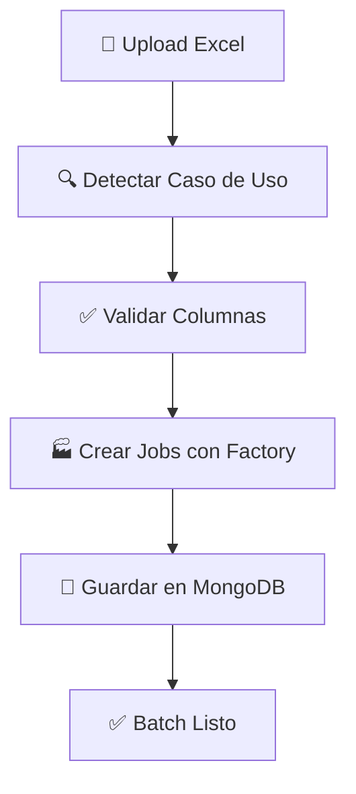
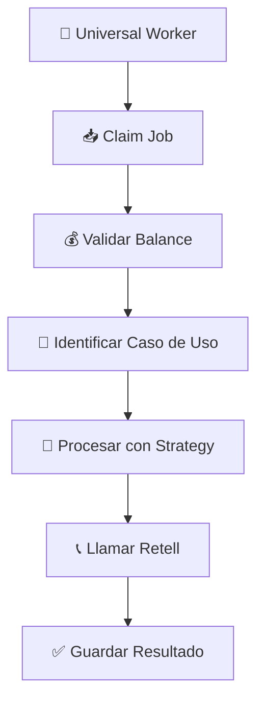

# 🎯 **ARQUITECTURA UNIVERSAL SPEECHAI - MULTI CASO DE USO**

## 🏗️ **Estructura del Proyecto**

```
speechAi_backend/
├── 📋 README.md
├── 🛠️ requirements.txt
├── ⚙️ .env / .env.example
├── 📂 app/
│   ├── 🚀 **universal_api.py**           # API principal multi-caso de uso
│   ├── 🤖 **universal_call_worker.py**   # Worker genérico para cualquier caso de uso
│   ├── 🧪 test_balance_protection.py     # Tests de protección SaaS
│   │
│   ├── 📂 **domain/**                    # DOMAIN LAYER (DDD)
│   │   ├── 📄 enums.py                   # Enums básicos (JobStatus, CallStatus, etc.)
│   │   ├── 📄 models.py                  # Modelos legacy (mantenido por compatibilidad)
│   │   ├── 📄 use_case_registry.py       # 🔥 Registry central de casos de uso
│   │   │
│   │   ├── 📂 **abstract/**              # ABSTRACCIONES BASE
│   │   │   ├── 📄 base_models.py         # Modelos base abstractos
│   │   │   └── 📄 use_case_enums.py      # Enums de casos de uso
│   │   │
│   │   └── 📂 **use_cases/**             # IMPLEMENTACIONES CONCRETAS
│   │       ├── 📄 debt_collection.py     # 💰 Cobranza de deudas
│   │       ├── 📄 user_experience.py     # 😊 Experiencia de usuario
│   │       ├── 📄 survey.py              # 📊 Encuestas (futuro)
│   │       └── 📄 reminder.py            # ⏰ Recordatorios (futuro)
│   │
│   ├── 📂 **utils/**                     # UTILIDADES
│   │   ├── 📄 excel_processor.py         # Legacy processor (cobranza)
│   │   └── 📄 **universal_excel_processor.py** # 🔥 Procesador universal
│   │
│   ├── 📂 **infrastructure/**            # INFRASTRUCTURE LAYER
│   │   ├── 📄 mongo_client.py           # Cliente MongoDB
│   │   └── 📄 retell_client.py          # Cliente Retell AI
│   │
│   ├── 📂 **services/**                 # APPLICATION SERVICES
│   │   ├── 📄 batch_service.py          # Gestión de batches
│   │   └── 📄 account_service.py        # Gestión de cuentas
│   │
│   └── 📂 **config/**                   # CONFIGURACIÓN
│       ├── 📄 database.py               # Config DB
│       └── 📄 settings.py               # Settings generales
│
├── 📂 **docs/**                         # DOCUMENTACIÓN
│   ├── 📄 ARCHITECTURE.md               # Arquitectura del sistema
│   ├── 📄 USE_CASES.md                  # Documentación de casos de uso
│   └── 📄 API_GUIDE.md                  # Guía de la API
│
├── 📂 **scripts/**                      # SCRIPTS DE UTILIDAD
│   ├── 📄 migrate_legacy_jobs.py        # Migración de jobs legacy
│   └── 📄 setup_test_data.py            # Datos de prueba
│
└── 📂 **sql/**                          # SCHEMAS DE REFERENCIA
    ├── 📄 catalogos.sql
    ├── 📄 nucleoOperativo.sql
    └── 📄 operacion.sql
```

## 🎯 **Casos de Uso Soportados**

### 1. **💰 Cobranza de Deudas** (`debt_collection`)
```json
{
  "required_columns": ["nombre", "rut", "telefono", "deuda", "fecha_vencimiento", "empresa"],
  "script_template": "debt_collection_script_v1",
  "context_variables": ["monto_total", "fecha_limite", "empresa", "numero_referencia"]
}
```

### 2. **😊 Experiencia de Usuario** (`user_experience`)  
```json
{
  "required_columns": ["nombre", "customer_id", "telefono", "interaction_type", "producto_servicio"],
  "script_template": "ux_post_purchase_v1 | ux_feedback_collection_v1 | ux_survey_v1",
  "context_variables": ["cliente_id", "producto_servicio", "tipo_interaccion"]
}
```

### 3. **📊 Encuestas** (`survey`) - *Futuro*
### 4. **⏰ Recordatorios** (`reminder`) - *Futuro*

## 🔄 **Flujo de Trabajo Universal**

### **Creación de Batch**


### **Procesamiento de Jobs**


## 🏛️ **Arquitectura (Clean Architecture + DDD)**

### **Domain Layer** 
- **Abstract Models**: Contratos base para todos los casos de uso
- **Concrete Use Cases**: Implementaciones específicas
- **Registry**: Sistema de registro dinámico
- **Enums**: Tipos y estados del dominio

### **Application Layer**
- **Universal Processors**: Lógica de negocio genérica
- **Services**: Operaciones de aplicación
- **API**: Endpoints REST universales

### **Infrastructure Layer**
- **MongoDB**: Persistencia de datos
- **Retell AI**: Integración de llamadas
- **Excel Processing**: Importación de datos

## 🎮 **Cómo Agregar Nuevos Casos de Uso**

### 1. **Crear Implementación Concreta**
```python
# domain/use_cases/mi_nuevo_caso.py
@dataclass
class MiNuevoCasoPayload(BaseJobPayload):
    def to_retell_context(self) -> Dict[str, str]:
        # Lógica específica
        pass

class MiNuevoCasoProcessor(BaseJobProcessor):
    def process_job(self, job: BaseJobModel) -> Dict[str, Any]:
        # Procesamiento específico
        pass
```

### 2. **Registrar en Registry**
```python
# El registry se actualiza automáticamente al importar
registry.register_use_case(
    use_case="mi_nuevo_caso",
    job_class=MiNuevoCasoJob,
    batch_class=MiNuevoCasoBatch,
    job_factory_class=MiNuevoCasoFactory,
    job_processor_class=MiNuevoCasoProcessor
)
```

### 3. **¡Listo!** 
- La API automáticamente soportará el nuevo caso de uso
- El worker universal lo procesará
- El Excel processor lo reconocerá

## 🔐 **Protección SaaS Integrada**

- ✅ **Validación de Balance** antes de cada llamada
- ✅ **Soporte Multi-Plan**: `unlimited`, `minutes_based`, `credit_based`  
- ✅ **Fallo Terminal**: Jobs sin balance marcados como `failed`
- ✅ **Logging Detallado**: Auditoría completa de consumo

## 🚀 **Comandos de Ejecución**

```bash
# API Universal
python app/universal_api.py

# Worker Universal  
python app/universal_call_worker.py

# Test de Balance
python app/test_balance_protection.py setup
python app/test_balance_protection.py check
```

## 🎯 **Beneficios de la Nueva Arquitectura**

1. **🔧 Extensibilidad**: Agregar casos de uso sin tocar código existente
2. **🎯 Separación de Responsabilidades**: Cada caso de uso maneja su lógica
3. **🔄 Reutilización**: Infraestructura común para todos los casos
4. **🧪 Testabilidad**: Cada componente es independiente
5. **📈 Escalabilidad**: Workers pueden procesar cualquier tipo de job
6. **💡 Mantenibilidad**: Código limpio siguiendo principios SOLID

---

**🎉 ¡Tu plataforma SaaS está lista para escalar a múltiples casos de uso!**