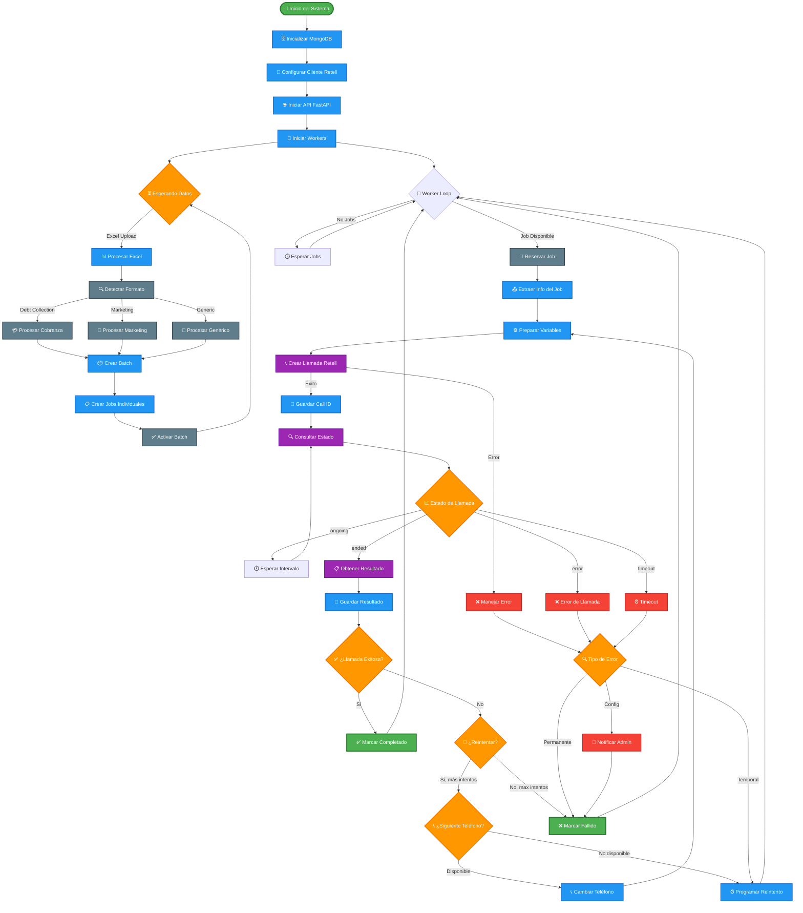
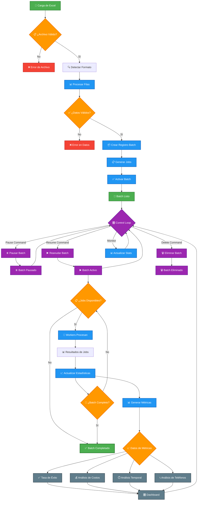

# 🔄 Diagramas de Flujo - SpeechAI Backend

## 📊 Flujo Principal del Sistema

---

## 📞 Flujo Detallado de Procesamiento de Llamadas

```mermaid
flowchart TD
    %% ===== INICIO DE PROCESAMIENTO =====
    JobClaimed[📌 Job Reservado por Worker] --> ValidateJob{✅ ¿Job Válido?}
    ValidateJob -->|No| ReleaseJob[🔓 Liberar Job]
    ValidateJob -->|Sí| ExtractContact[👤 Extraer Info Contacto]
    
    ExtractContact --> ValidatePhone{📞 ¿Teléfono Válido?}
    ValidatePhone -->|No| TryNextPhone[📞 Siguiente Teléfono]
    ValidatePhone -->|Sí| PreparePayload[📦 Preparar Payload]
    
    TryNextPhone --> HasMorePhones{📞 ¿Más Teléfonos?}
    HasMorePhones -->|No| FailJob[❌ Fallar Job - Sin Teléfonos]
    HasMorePhones -->|Sí| ValidatePhone
    
    %% ===== PREPARACIÓN DE LLAMADA =====
    PreparePayload --> ExtractVariables[⚙️ Extraer Variables del Payload]
    ExtractVariables --> AddContactInfo[👤 Agregar Info de Contacto]
    AddContactInfo --> AddAdditionalInfo[➕ Agregar Info Adicional]
    AddAdditionalInfo --> ValidateRetellConfig{🤖 ¿Config Retell OK?}
    
    ValidateRetellConfig -->|No| ConfigError[❌ Error de Configuración]
    ValidateRetellConfig -->|Sí| CreateRetellCall[🤖 Crear Llamada en Retell]
    
    %% ===== CREACIÓN EN RETELL AI =====
    CreateRetellCall --> RetellResponse{📡 Respuesta Retell}
    RetellResponse -->|Error 401| AuthError[🔐 Error de Autenticación]
    RetellResponse -->|Error 429| RateLimitError[⏱️ Rate Limit Excedido]
    RetellResponse -->|Error 500| RetellServerError[🔥 Error Servidor Retell]
    RetellResponse -->|Success 201| CallCreated[✅ Llamada Creada]
    
    %% ===== MANEJO DE ERRORES DE CREACIÓN =====
    AuthError --> RetryConfig{🔄 ¿Reintentar Config?}
    RateLimitError --> WaitRateLimit[⏱️ Esperar Rate Limit]
    RetellServerError --> RetryCall{🔄 ¿Reintentar Llamada?}
    
    RetryConfig -->|Sí| CreateRetellCall
    RetryConfig -->|No| ConfigError
    WaitRateLimit --> CreateRetellCall
    RetryCall -->|Sí| CreateRetellCall
    RetryCall -->|No| TempFailJob[⏰ Fallo Temporal]
    
    %% ===== SEGUIMIENTO DE LLAMADA =====
    CallCreated --> SaveCallID[💾 Guardar Call ID]
    SaveCallID --> StartPolling[🔍 Iniciar Polling]
    StartPolling --> PollStatus[📊 Consultar Estado]
    
    PollStatus --> ParseStatus{📋 Analizar Estado}
    ParseStatus -->|registered| WaitPolling[⏱️ Esperar Intervalo]
    ParseStatus -->|ongoing| WaitPolling
    ParseStatus -->|ended| ProcessResult[📋 Procesar Resultado]
    ParseStatus -->|error| CallErrorState[❌ Estado Error]
    ParseStatus -->|timeout| CallTimeout[⏰ Timeout de Llamada]
    
    WaitPolling --> CheckPollTimeout{⏰ ¿Timeout Polling?}
    CheckPollTimeout -->|No| PollStatus
    CheckPollTimeout -->|Sí| CallTimeout
    
    %% ===== PROCESAMIENTO DE RESULTADOS =====
    ProcessResult --> ExtractTranscript[📝 Extraer Transcripción]
    ExtractTranscript --> ExtractAnalysis[🧠 Extraer Análisis]
    ExtractAnalysis --> ExtractCosts[💰 Extraer Costos]
    ExtractCosts --> SaveCompleteResult[💾 Guardar Resultado Completo]
    
    SaveCompleteResult --> EvaluateSuccess{⭐ ¿Llamada Exitosa?}
    EvaluateSuccess -->|Sí| CompleteJob[✅ Completar Job]
    EvaluateSuccess -->|No| ProcessFailure[❌ Procesar Fallo]
    
    %% ===== MANEJO DE FALLOS =====
    CallErrorState --> ProcessFailure
    CallTimeout --> ProcessFailure
    TempFailJob --> ProcessFailure
    ConfigError --> ProcessFailure
    
    ProcessFailure --> CheckAttempts{🔢 ¿Más Intentos?}
    CheckAttempts -->|No| FinalFail[❌ Fallo Final]
    CheckAttempts -->|Sí| CheckPhoneRotation{📞 ¿Rotar Teléfono?}
    
    CheckPhoneRotation -->|Sí| RotatePhone[📞 Cambiar a Siguiente]
    CheckPhoneRotation -->|No| ScheduleRetry[⏰ Programar Reintento]
    
    RotatePhone --> HasMorePhones
    ScheduleRetry --> RetryJob[🔄 Job Listo para Reintento]
    
    %% ===== FINALES =====
    CompleteJob --> JobComplete[✅ Job Completado]
    FinalFail --> JobFailed[❌ Job Fallido]
    RetryJob --> JobScheduled[⏰ Job Programado]
    ReleaseJob --> JobReleased[🔓 Job Liberado]
    
    %% ===== ESTILOS =====
    classDef success fill:#4caf50,stroke:#2e7d32,stroke-width:3px,color:#fff
    classDef error fill:#f44336,stroke:#c62828,stroke-width:2px,color:#fff
    classDef warning fill:#ff9800,stroke:#ef6c00,stroke-width:2px,color:#fff
    classDef process fill:#2196f3,stroke:#1565c0,stroke-width:2px,color:#fff
    classDef decision fill:#9c27b0,stroke:#6a1b9a,stroke-width:2px,color:#fff
    classDef retell fill:#673ab7,stroke:#4527a0,stroke-width:2px,color:#fff
    classDef retry fill:#607d8b,stroke:#37474f,stroke-width:2px,color:#fff
    
    class JobComplete,CompleteJob,CallCreated success
    class FailJob,FinalFail,JobFailed,ConfigError,AuthError,RetellServerError,CallErrorState,CallTimeout error
    class TempFailJob,WaitRateLimit,RetryJob,JobScheduled,TryNextPhone,RotatePhone warning
    class ExtractContact,PreparePayload,ExtractVariables,SaveCallID,ProcessResult,ExtractTranscript process
    class ValidateJob,ValidatePhone,HasMorePhones,ValidateRetellConfig,RetellResponse,ParseStatus,EvaluateSuccess,CheckAttempts,CheckPhoneRotation decision
    class CreateRetellCall,StartPolling,PollStatus retell
    class ScheduleRetry,CheckPollTimeout,RetryConfig,RetryCall retry
```

---

## 📊 Flujo de Gestión de Batches

---

## 🔧 Flujo de Configuración y Startup

```mermaid
flowchart TD
    %% ===== STARTUP SEQUENCE =====
    AppStart([🚀 Inicio Aplicación]) --> LoadEnv[📁 Cargar Variables .env]
    LoadEnv --> ValidateConfig{⚙️ ¿Config Válida?}
    ValidateConfig -->|No| ConfigError[❌ Error Configuración]
    ValidateConfig -->|Sí| InitLogging[📝 Inicializar Logging]
    
    InitLogging --> ConnectMongoDB[🗄️ Conectar MongoDB]
    ConnectMongoDB --> MongoSuccess{✅ ¿Conexión OK?}
    MongoSuccess -->|No| MongoError[❌ Error MongoDB]
    MongoSuccess -->|Sí| CreateIndexes[📑 Crear Índices]
    
    CreateIndexes --> InitRetellClient[🤖 Inicializar Cliente Retell]
    InitRetellClient --> TestRetell{🧪 ¿Test Retell OK?}
    TestRetell -->|No| RetellError[❌ Error Retell]
    TestRetell -->|Sí| InitServices[🚀 Inicializar Servicios]
    
    %% ===== SERVICE INITIALIZATION =====
    InitServices --> CreateDatabaseManager[🗄️ Database Manager]
    CreateDatabaseManager --> CreateBatchService[📦 Batch Service]
    CreateBatchService --> CreateJobService[📋 Job Service]
    CreateJobService --> CreateCallService[📞 Call Service]
    CreateCallService --> CreateWorkerCoordinator[👷 Worker Coordinator]
    
    %% ===== API STARTUP =====
    CreateWorkerCoordinator --> StartFastAPI[🌐 Iniciar FastAPI]
    StartFastAPI --> APIReady{✅ API Lista?}
    APIReady -->|No| APIError[❌ Error API]
    APIReady -->|Sí| StartWorkers[👷 Iniciar Workers]
    
    %% ===== WORKER STARTUP =====
    StartWorkers --> ConfigureWorkers[⚙️ Configurar Workers]
    ConfigureWorkers --> CreateWorkerThreads[🧵 Crear Threads]
    CreateWorkerThreads --> StartWorkerLoop[🔄 Iniciar Worker Loops]
    StartWorkerLoop --> SystemReady[✅ Sistema Listo]
    
    %% ===== HEALTH CHECKS =====
    SystemReady --> HealthCheckLoop{🏥 Health Check Loop}
    HealthCheckLoop --> CheckMongo[🗄️ Check MongoDB]
    CheckMongo --> CheckRetell[🤖 Check Retell]
    CheckRetell --> CheckWorkers[👷 Check Workers]
    CheckWorkers --> SystemHealthy{💚 ¿Sistema Saludable?}
    
    SystemHealthy -->|Sí| HealthCheckLoop
    SystemHealthy -->|No| AlertAdmins[🚨 Alertar Admins]
    AlertAdmins --> TryRecover[🔧 Intentar Recuperar]
    TryRecover --> HealthCheckLoop
    
    %% ===== ERROR HANDLING =====
    ConfigError --> LogError[📝 Log Error]
    MongoError --> LogError
    RetellError --> LogError
    APIError --> LogError
    
    LogError --> NotifyAdmins[📧 Notificar Admins]
    NotifyAdmins --> ExitApp[🚪 Salir Aplicación]
    
    %% ===== GRACEFUL SHUTDOWN =====
    SystemReady --> WaitSignal{⏳ Esperar Señal}
    WaitSignal -->|SIGTERM/SIGINT| GracefulShutdown[🛑 Shutdown Graceful]
    WaitSignal -->|Continue| HealthCheckLoop
    
    GracefulShutdown --> StopWorkers[🛑 Detener Workers]
    StopWorkers --> CloseConnections[🔌 Cerrar Conexiones]
    CloseConnections --> CleanupResources[🧹 Limpiar Recursos]
    CleanupResources --> AppExit[🚪 Salida Limpia]
    
    %% ===== ESTILOS =====
    classDef start fill:#4caf50,stroke:#2e7d32,stroke-width:3px,color:#fff
    classDef process fill:#2196f3,stroke:#1565c0,stroke-width:2px,color:#fff
    classDef decision fill:#ff9800,stroke:#ef6c00,stroke-width:2px,color:#fff
    classDef error fill:#f44336,stroke:#c62828,stroke-width:2px,color:#fff
    classDef success fill:#4caf50,stroke:#2e7d32,stroke-width:2px,color:#fff
    classDef health fill:#00bcd4,stroke:#0097a7,stroke-width:2px,color:#fff
    classDef shutdown fill:#9e9e9e,stroke:#424242,stroke-width:2px,color:#fff
    
    class AppStart,SystemReady start
    class LoadEnv,InitLogging,ConnectMongoDB,CreateIndexes,InitRetellClient,InitServices,CreateDatabaseManager,CreateBatchService,CreateJobService,CreateCallService,CreateWorkerCoordinator,StartFastAPI,StartWorkers,ConfigureWorkers,CreateWorkerThreads,StartWorkerLoop process
    class ValidateConfig,MongoSuccess,TestRetell,APIReady,SystemHealthy,WaitSignal decision
    class ConfigError,MongoError,RetellError,APIError,LogError,NotifyAdmins,ExitApp error
    class AppExit success
    class HealthCheckLoop,CheckMongo,CheckRetell,CheckWorkers,AlertAdmins,TryRecover health
    class GracefulShutdown,StopWorkers,CloseConnections,CleanupResources shutdown
```

---

## 📈 Métricas y KPIs de los Flujos

### ⏱️ **Tiempos de Respuesta Esperados**
- **Creación de llamada**: < 2 segundos
- **Polling de estado**: 10-15 segundos de intervalo
- **Procesamiento de job**: 5-10 minutos total
- **Carga de Excel**: < 30 segundos para 1000 registros
- **Generación de reporte**: < 60 segundos

### 📊 **Tasas de Éxito Objetivo**
- **Conexión exitosa**: > 95%
- **Completado vs Iniciado**: > 70%
- **Reintentos exitosos**: > 40%
- **Disponibilidad del sistema**: > 99.5%

### 🔄 **Capacidad de Procesamiento**
- **Jobs por hora**: 120-360 (dependiendo de workers)
- **Llamadas concurrentes**: 6-20 (configurable)
- **Throughput máximo**: 10 jobs/minuto por worker