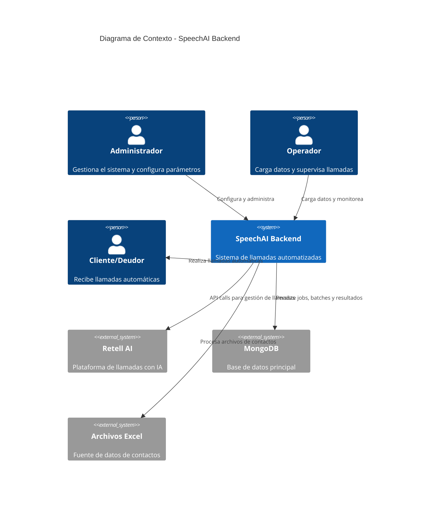
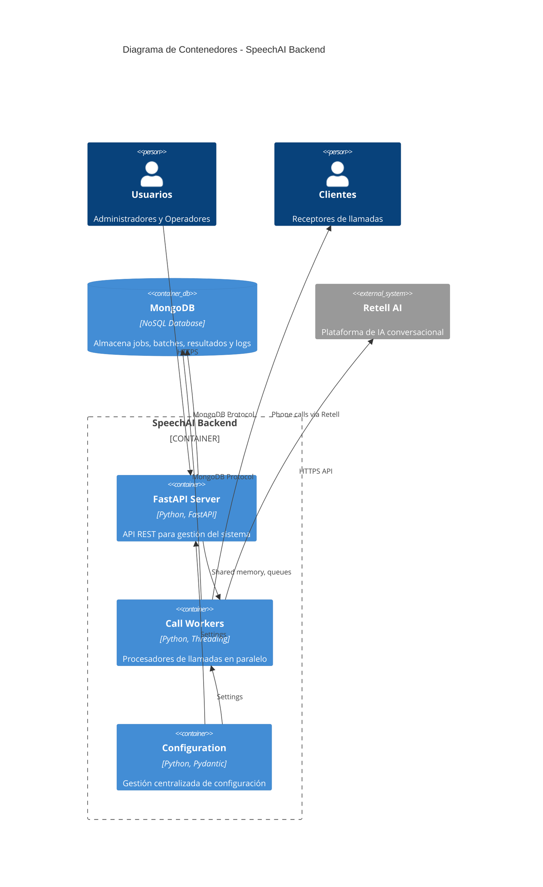
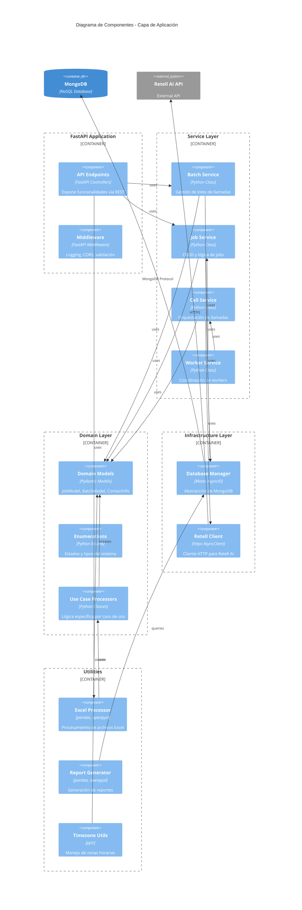
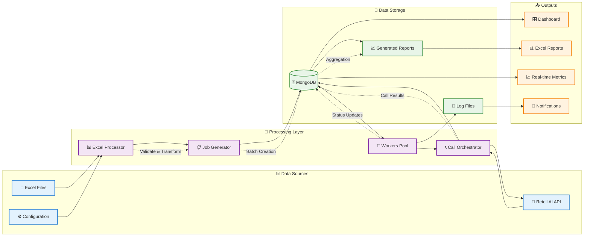
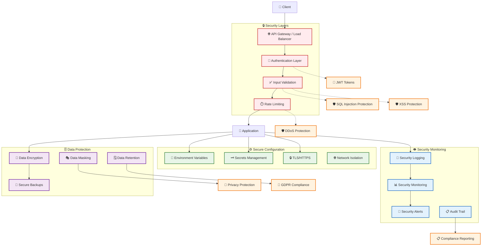

# 📐 Diagrama de Arquitectura del Sistema - SpeechAI Backend







---

## 🏗️ Arquitectura de Despliegue

```mermaid
deployment
    title Diagrama de Despliegue - SpeechAI Backend

    node "Production Server" as prod_server {
        node "Docker Container: speechai-api" as api_container {
            artifact "FastAPI Application" as api_app
            artifact "Configuration Files" as config_files
        }
        
        node "Docker Container: speechai-workers" as worker_container {
            artifact "Call Workers" as workers
            artifact "Worker Coordinator" as coordinator
        }
        
        node "Docker Container: mongodb" as mongo_container {
            database "MongoDB Database" as mongodb
            artifact "Data Volumes" as data_volumes
        }
    }

    node "External Services" as external {
        cloud "Retell AI Platform" as retell_cloud
        cloud "Monitoring Service" as monitoring
        cloud "Log Aggregation" as logs
    }

    node "Development Environment" as dev_env {
        artifact "Local MongoDB" as local_mongo
        artifact "Development Server" as dev_server
        artifact "Test Scripts" as test_scripts
    }

    node "Client Access" as clients {
        artifact "Web Browser" as browser
        artifact "API Clients" as api_clients
        artifact "Admin Tools" as admin_tools
    }

    api_container --> mongo_container : "Database connections"
    worker_container --> mongo_container : "Database connections"
    worker_container --> retell_cloud : "API calls"
    
    api_container --> monitoring : "Health metrics"
    worker_container --> monitoring : "Performance metrics"
    
    api_container --> logs : "Application logs"
    worker_container --> logs : "Worker logs"
    
    clients --> api_container : "HTTPS requests"
    
    dev_env --> external : "Testing connections"
```

---

## 🔄 Flujo de Datos



---

## 🔐 Diagrama de Seguridad



---

## 📊 Diagrama de Escalabilidad

```mermaid
graph TB
    %% ===== ESCALABILIDAD HORIZONTAL =====
    subgraph "📈 Horizontal Scaling"
        LB[⚖️ Load Balancer]
        API1[🌐 API Instance 1]
        API2[🌐 API Instance 2]
        API3[🌐 API Instance N]
        
        Workers1[👷 Worker Pool 1]
        Workers2[👷 Worker Pool 2]
        Workers3[👷 Worker Pool N]
    end

    %% ===== ESCALABILIDAD DE DATOS =====
    subgraph "🗄️ Data Scaling"
        MongoCluster[🗄️ MongoDB Cluster]
        Primary[(🗄️ Primary)]
        Secondary1[(🗄️ Secondary 1)]
        Secondary2[(🗄️ Secondary 2)]
        
        Sharding[🔀 Sharding Strategy]
        Indexing[📑 Advanced Indexing]
    end

    %% ===== CACHE Y PERFORMANCE =====
    subgraph "⚡ Performance Layer"
        Redis[🔄 Redis Cache]
        CDN[🌐 CDN]
        Queue[📬 Job Queue]
        Metrics[📊 Metrics Collection]
    end

    %% ===== MONITOREO DE ESCALABILIDAD =====
    subgraph "📊 Scaling Monitoring"
        AutoScale[🔄 Auto Scaling]
        HealthCheck[💚 Health Checks]
        ResourceMonitor[📈 Resource Monitoring]
        AlertManager[🚨 Alert Manager]
    end

    %% ===== CONEXIONES =====
    LB --> API1
    LB --> API2
    LB --> API3
    
    API1 --> Workers1
    API2 --> Workers2
    API3 --> Workers3
    
    Workers1 --> Queue
    Workers2 --> Queue
    Workers3 --> Queue
    
    API1 --> MongoCluster
    API2 --> MongoCluster
    API3 --> MongoCluster
    
    MongoCluster --> Primary
    Primary --> Secondary1
    Primary --> Secondary2
    
    API1 --> Redis
    API2 --> Redis
    API3 --> Redis
    
    AutoScale --> LB
    HealthCheck --> API1
    HealthCheck --> API2
    HealthCheck --> API3
    
    ResourceMonitor --> AlertManager
    Metrics --> ResourceMonitor

    %% ===== ESTRATEGIAS DE ESCALADO =====
    AutoScale -.-> CPUScaling[📊 CPU-based Scaling]
    AutoScale -.-> QueueScaling[📬 Queue-based Scaling]
    AutoScale -.-> TimeScaling[⏰ Time-based Scaling]
    
    Sharding -.-> DateSharding[📅 Date-based Sharding]
    Sharding -.-> BatchSharding[📦 Batch-based Sharding]
    
    %% ===== ESTILOS =====
    classDef scaling fill:#e8f5e8,stroke:#2e7d32,stroke-width:2px
    classDef data fill:#e3f2fd,stroke:#1565c0,stroke-width:2px
    classDef performance fill:#fff3e0,stroke:#ef6c00,stroke-width:2px
    classDef monitoring fill:#f3e5f5,stroke:#6a1b9a,stroke-width:2px
    classDef strategy fill:#ffebee,stroke:#c62828,stroke-width:2px
    
    class LB,API1,API2,API3,Workers1,Workers2,Workers3 scaling
    class MongoCluster,Primary,Secondary1,Secondary2,Sharding,Indexing data
    class Redis,CDN,Queue,Metrics performance
    class AutoScale,HealthCheck,ResourceMonitor,AlertManager monitoring
    class CPUScaling,QueueScaling,TimeScaling,DateSharding,BatchSharding strategy
```



---

## 📝 Resumen de Documentación de Arquitectura

### 📐 **Diagramas Creados**

1. **🏗️ Diagrama de Contexto (C4)**: Vista general del sistema y actores externos
2. **📦 Diagrama de Contenedores**: Distribución de componentes principales
3. **🔧 Diagrama de Componentes**: Estructura interna detallada
4. **🚀 Diagrama de Despliegue**: Arquitectura de infraestructura
5. **🔄 Flujo de Datos**: Transformación y movimiento de información
6. **🔐 Diagrama de Seguridad**: Capas de protección y controles
7. **📈 Diagrama de Escalabilidad**: Estrategias de crecimiento

### 🎯 **Principios Arquitectónicos**

- **🏛️ Clean Architecture**: Separación clara de responsabilidades
- **🔄 Domain Driven Design**: Modelado centrado en el dominio de negocio
- **📦 Microservicios Modulares**: Componentes débilmente acoplados
- **⚡ Asíncrono por Defecto**: Operaciones no bloqueantes
- **🔒 Seguridad por Capas**: Múltiples niveles de protección
- **📊 Observabilidad**: Monitoreo y métricas integradas
- **🚀 Escalabilidad Horizontal**: Crecimiento distribuido

### 📊 **Métricas de Arquitectura**

- **Disponibilidad**: 99.5% uptime objetivo
- **Latencia**: < 2s para operaciones críticas  
- **Throughput**: 10 jobs/minuto por worker
- **Escalabilidad**: Lineal con número de workers
- **Recuperación**: < 30s para fallos temporales