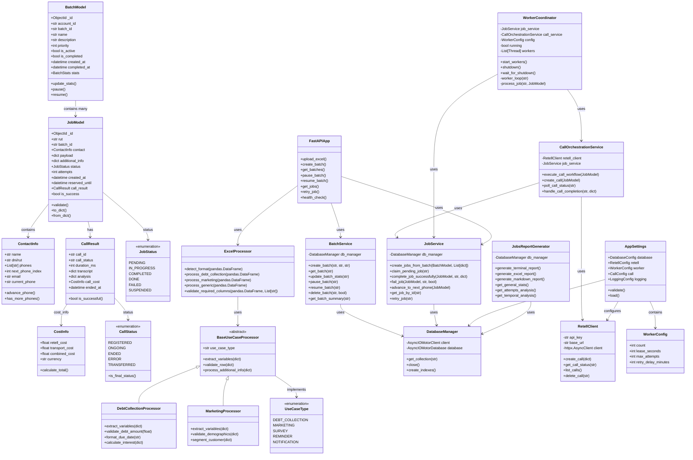

# 📐 Diagrama de Clases - SpeechAI Backend

## 📝 Descripción de Componentes Principales

### 🏛️ **Domain Layer**
- **JobModel**: Entidad principal que representa un trabajo de llamada
- **ContactInfo**: Información de contacto con gestión de múltiples teléfonos
- **BatchModel**: Agrupación de jobs con control de estado
- **CallResult**: Resultado completo de una llamada con costos y transcripción

### 🚀 **Services Layer**
- **BatchService**: Gestión completa de lotes de trabajo
- **JobService**: CRUD y lógica de negocio de jobs individuales
- **CallOrchestrationService**: Orquestación del flujo completo de llamadas
- **WorkerCoordinator**: Coordinación de workers paralelos

### 🏗️ **Infrastructure Layer**
- **DatabaseManager**: Abstracción de MongoDB con conexiones async
- **RetellClient**: Cliente HTTP para interactuar con Retell AI API

### 🛠️ **Utilities**
- **ExcelProcessor**: Procesamiento inteligente de archivos Excel
- **JobsReportGenerator**: Generación de reportes en múltiples formatos

### ⚙️ **Configuration**
- **AppSettings**: Configuración centralizada con validación
- **WorkerConfig**: Configuración específica de workers

---

## 🔗 Patrones de Diseño Implementados

1. **Repository Pattern**: DatabaseManager abstrae el acceso a datos
2. **Factory Pattern**: BaseUseCaseProcessor para diferentes tipos de casos
3. **Strategy Pattern**: Múltiples procesadores de Excel según formato
4. **Observer Pattern**: Polling system para estado de llamadas
5. **Command Pattern**: Jobs como comandos ejecutables
6. **Singleton Pattern**: AppSettings como configuración única
7. **Builder Pattern**: JobModel construction con validaciones